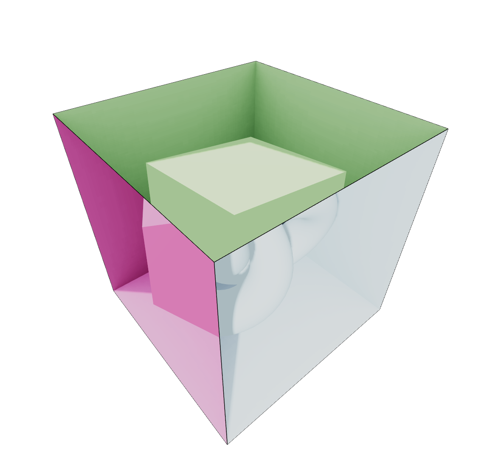

## Notes

Set materials for each sides of box by indicating the index
```
<boxGeometry>
<Side index={0}>
```

Path from public should be set correctly (without "\")
```
useGLTF('/aobox-transformed.glb') -> useGLTF('aobox-transformed.glb')
```


[**Live Demo**](https://nodejs.org/en/download/](https://momentchan.github.io/r3f-magic-box/))
